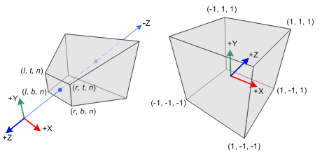

<section id="themes">
	<h2>Themes</h2>
		<p>
			Set your presentation theme: <br>
			<!-- Hacks to swap themes after the page has loaded. Not flexible and only intended for the reveal.js demo deck. -->
                        <a href="#" onclick="document.getElementById('theme').setAttribute('href','css/theme/black.css'); return false;">Black (default)</a> -
			<a href="#" onclick="document.getElementById('theme').setAttribute('href','css/theme/white.css'); return false;">White</a> -
			<a href="#" onclick="document.getElementById('theme').setAttribute('href','css/theme/league.css'); return false;">League</a> -
			<a href="#" onclick="document.getElementById('theme').setAttribute('href','css/theme/sky.css'); return false;">Sky</a> -
			<a href="#" onclick="document.getElementById('theme').setAttribute('href','css/theme/beige.css'); return false;">Beige</a> -
			<a href="#" onclick="document.getElementById('theme').setAttribute('href','css/theme/simple.css'); return false;">Simple</a> <br>
			<a href="#" onclick="document.getElementById('theme').setAttribute('href','css/theme/serif.css'); return false;">Serif</a> -
			<a href="#" onclick="document.getElementById('theme').setAttribute('href','css/theme/blood.css'); return false;">Blood</a> -
			<a href="#" onclick="document.getElementById('theme').setAttribute('href','css/theme/night.css'); return false;">Night</a> -
			<a href="#" onclick="document.getElementById('theme').setAttribute('href','css/theme/moon.css'); return false;">Moon</a> -
			<a href="#" onclick="document.getElementById('theme').setAttribute('href','css/theme/solarized.css'); return false;">Solarized</a>
		</p>
</section>

H:

# Transformations

Jean Pierre Charalambos

H:

## Index

 1. Intro<!-- .element: class="fragment" data-fragment-index="1"-->
    * Active vs pasive transformations
 2. Linear transformations<!-- .element: class="fragment" data-fragment-index="2"-->
    * Scaling, rotation & shearing
 3. Affine transformations<!-- .element: class="fragment" data-fragment-index="3"-->
    * Homogeneous space
    * Translation
    * Scaling, rotation & shearing revisited
    * Matrix operations: orthogonality, inversion & composition

V:

## Index (part 2)

 4. Modelling and view<!-- .element: class="fragment" data-fragment-index="4"-->
 5. Projections<!-- .element: class="fragment" data-fragment-index="5"-->
    * Orthographic
    * Perspective
 6. Matrix handling in the frames framework<!-- .element: class="fragment" data-fragment-index="6"-->
 
H:

## Intro: Active vs pasive transformations

<font color="yellow"> Active Transformation (standard basis) vs Passive Transformation (change of basis)</font>


N:

* Standard = Canonical

H:

## Linear transformations: Notion

Property 1<!-- .element: class="fragment" data-fragment-index="1"-->
   $$F(a+b)= F(a)+ F(b)$$

Property 2<!-- .element: class="fragment" data-fragment-index="2"-->
   $$F(\lambda a) = \lambda F(a)\rightarrow F(0) = 0$$

Observation 1:<!-- .element: class="fragment" data-fragment-index="3"-->
   Matrix multiplication is always linear

Observation 2:<!-- .element: class="fragment" data-fragment-index="4"-->
   Translation is a nonlinear transformation
   
V:

## Linear transformations: 2d scaling

<div class="ulist">
    
    <ul style="width: 57%;">
        <p class="fragment" data-fragment-index="1">
        `$x'= sx*x$`
        </p>
        <p class="fragment" data-fragment-index="2">
        `$y'= sy*y$`
        </p>
        <p class="fragment" data-fragment-index="3">
        `$\begin{bmatrix} 
        x' \cr 
        y' \cr
        \end{bmatrix}
        = 
        \begin{bmatrix}
        sx & 0 \cr
        0 & sy \cr
        \end{bmatrix} \bullet \begin{bmatrix} 
        x \cr 
        y \cr
        \end{bmatrix}
        $`
        </p>
        <p class="fragment" data-fragment-index="4">
        $P'= S(sx,sy) \bullet P$
        </p>
    </ul>
</div>

N:

* mirroring and reflections are missed

V:

## Linear transformations: 3d scaling

<div class="ulist">
    
    <ul style="width: 65%;">
        <p class="fragment" data-fragment-index="1">
        `$x'= sx*x$`
        </p>
        <p class="fragment" data-fragment-index="2">
        `$y'= sy*y$`
        </p>
        <p class="fragment" data-fragment-index="3">
        `$z'= sz*z$`
        </p>
        <p class="fragment" data-fragment-index="4">
        `$\begin{bmatrix} 
        x' \cr 
        y' \cr
        z' \cr
        \end{bmatrix}
        = 
        \begin{bmatrix}
        sx & 0 & 0 \cr
        0 & sy & 0 \cr
        0 & 0 & sz \cr
        \end{bmatrix} \bullet \begin{bmatrix} 
        x \cr 
        y \cr
        z \cr
        \end{bmatrix}
        $`
        </p>
        <p class="fragment" data-fragment-index="5">
        $P'= S(sx,sy,sz) \bullet P$
        </p>
    </ul>
</div>

N:

* mirroring and reflections are missed

V:

## Linear transformations: 2d rotation

<div class="ulist">
    
    <ul style="width: 57%;">        
        <p class="fragment" data-fragment-index="1">
        $x = rcos \alpha$
        </p>
        <p class="fragment" data-fragment-index="2">
        $y= rsin \alpha$
        </p>
        <p class="fragment" data-fragment-index="3">
        $x'= rcos (\alpha+\beta)$
        $x'= rcos \alpha cos \beta - rsin \alpha sin \beta$
        </p>
        <p class="fragment" data-fragment-index="4">
        $y'= rsin (\alpha+\beta)$
        $y'= rcos \alpha sin \beta - rsin \alpha cos \beta$
        </p>
    </ul>
</div>

V:

## Linear transformations: 2d Rotation

<div class="ulist">
    
    <ul style="width: 57%;">        
        <p class="fragment" data-fragment-index="1">
        `$\begin{bmatrix} 
        x' \cr 
        y' \cr
        \end{bmatrix}
        = 
        \begin{bmatrix}
        cos\beta & -sin \beta \cr
        sin\beta & cos \beta \cr
        \end{bmatrix} \bullet \begin{bmatrix} 
        x \cr 
        y \cr
        \end{bmatrix}
        $`
        </p>
        <p class="fragment" data-fragment-index="2">
        $P'= R(\beta) \bullet P$
        </p>
    </ul>
</div>

V:

## Linear transformations: 3d rotation
### Euler angles (respect to z-axis)

<div class="ulist">
    
    <ul style="width: 67%;">
        <p class="fragment" data-fragment-index="1">
        $z' = z$
        </p>
        <p class="fragment" data-fragment-index="2">
        `$\begin{bmatrix} 
        x' \cr 
        y' \cr
        z' \cr
        \end{bmatrix}
        = 
        \begin{bmatrix}
        cos\beta & -sin \beta & 0 \cr
        sin\beta & cos \beta & 0 \cr
        0 & 0 & 1 \cr
        \end{bmatrix} \bullet \begin{bmatrix} 
        x \cr 
        y \cr
        z \cr
        \end{bmatrix}
        $`
        </p>
        <p class="fragment" data-fragment-index="3">
        $P'= R_z(\beta) \bullet P$
        </p>
    </ul>
</div>

V:

## Linear transformations: 3d rotation
### Euler angles (respect to x-axis)

<div class="ulist">
    
    <ul style="width: 67%;">
        <p class="fragment" data-fragment-index="1">
        $x' = x$
        </p>
        <p class="fragment" data-fragment-index="2">
        `$\begin{bmatrix} 
        x' \cr 
        y' \cr
        z' \cr
        \end{bmatrix}
        = 
        \begin{bmatrix}
        1 & 0 & 0 \cr
        0 & cos\beta & -sin \beta \cr
        0 & sin\beta & cos \beta \cr
        \end{bmatrix} \bullet \begin{bmatrix} 
        x \cr 
        y \cr
        z \cr
        \end{bmatrix}
        $`
        </p>
        <p class="fragment" data-fragment-index="3">
        $P'= R_x(\beta) \bullet P$
        </p>
    </ul>
</div>

V:

## Linear transformations: 3d rotation
### Euler angles (respect to y-axis)

<div class="ulist">
    
    <ul style="width: 67%;">
        <p class="fragment" data-fragment-index="1">
        $y' = y$
        </p>
        <p class="fragment" data-fragment-index="2">
        `$\begin{bmatrix} 
        x' \cr 
        y' \cr
        z' \cr
        \end{bmatrix}
        = 
        \begin{bmatrix}
        cos\beta & 0 & sin \beta \cr
        0 & 1 & 0 \cr
        -sin\beta & 0 & cos \beta \cr
        \end{bmatrix} \bullet \begin{bmatrix} 
        x \cr 
        y \cr
        z \cr
        \end{bmatrix}
        $`
        </p>
        <p class="fragment" data-fragment-index="3">
        $P'= R_y(\beta) \bullet P$
        </p>
    </ul>
</div>

V:

## Linear transformations: 2d shearing

<div class="ulist">
    
    <ul style="width: 57%;">
        <p class="fragment" data-fragment-index="1">
        `$x'= x + h*y$`
        </p>
        <p class="fragment" data-fragment-index="2">
        `$y'=y$`
        </p>
        <p class="fragment" data-fragment-index="3">
        `$\begin{bmatrix} 
        x' \cr 
        y' \cr
        \end{bmatrix}
        = 
        \begin{bmatrix}
        1 & h \cr
        0 & 1 \cr
        \end{bmatrix} \bullet \begin{bmatrix} 
        x \cr 
        y \cr
        \end{bmatrix}
        $`
        </p>
        <p class="fragment" data-fragment-index="4">
        $P'= D_y(h) \bullet P$
        </p>
    </ul>
</div>

V:

## Linear transformations: 2d shearing

<div class="ulist">
    
    <ul style="width: 57%;">
        <p class="fragment" data-fragment-index="1">
        `$x'= x$`
        </p>
        <p class="fragment" data-fragment-index="2">
        `$y'=y + h*x$`
        </p>
        <p class="fragment" data-fragment-index="3">
        `$\begin{bmatrix} 
        x' \cr 
        y' \cr
        \end{bmatrix}
        = 
        \begin{bmatrix}
        1 & 0 \cr
        h & 1 \cr
        \end{bmatrix} \bullet \begin{bmatrix} 
        x \cr 
        y \cr
        \end{bmatrix}
        $`
        </p>
        <p class="fragment" data-fragment-index="4">
        $P'= D_x(h) \bullet P$
        </p>
    </ul>
</div>

V:

## Linear transformations: 3d shearing

<div class="ulist">
    
    <ul style="width: 57%;">
        <p class="fragment" data-fragment-index="1">
        `$x'=x+az$`
        </p>
        <p class="fragment" data-fragment-index="2">
        `$y'=y+bz$`
        </p>
        <p class="fragment" data-fragment-index="3">
        `$z'=z$`
        </p>
        <p class="fragment" data-fragment-index="4">
        `$\begin{bmatrix} 
        x' \cr 
        y' \cr
        z' \cr
        \end{bmatrix}
        = 
        \begin{bmatrix}
        1 & 0 & a \cr
        0 & 1 & b \cr
        0 & 0 & 1 \cr
        \end{bmatrix} \bullet \begin{bmatrix} 
        x \cr 
        y \cr
        z \cr
        \end{bmatrix}
        $`
        </p>
        <p class="fragment" data-fragment-index="5">
        $P'= D_z(a,b) \bullet P$ (<a href="#/5/4">goto 2d translation</a>)
        </p>
    </ul>
</div>

V:

## Linear transformations: 3d shearing

...don't forget $P'= D_x(a,b) \bullet P$ and $P'= D_y(a,b) \bullet P$

H:

## Affine transformations
### Non-linearity of translation

<div class="ulist">
    
    <ul style="width: 57%;">
        <p class="fragment" data-fragment-index="1">
        `$x'= x + dx$`
        </p>
        <p class="fragment" data-fragment-index="2">
        `$y'=y + dy$`
        </p>
        <p class="fragment" data-fragment-index="3">
        `$\begin{bmatrix} 
        x' \cr 
        y' \cr
        \end{bmatrix}
        = 
        \begin{bmatrix}
        dx \cr
        dy \cr
        \end{bmatrix} + \begin{bmatrix} 
        x \cr 
        y \cr
        \end{bmatrix}
        $`
        </p>
        <p class="fragment" data-fragment-index="4">
        $P'= T(dx,dy) + P$
        </p>
    </ul>
</div>

V:

## Affine transformations: Notion

<p align ="center">
Linear transformations $+$ Translation $\rightarrow P' = M\ast P + T $
</p>

V:

## Affine transformations: Homogeneous space $\rightarrow$ 2d

<div class="ulist">
    
    <ul style="width: 57%;">
        <p class="fragment" data-fragment-index="1">
        Homogeneous w-coordinate: $(x,y,w)$
        </p>
        <p class="fragment" data-fragment-index="2">
        Homogeneous space $\rightarrow$ 2d
        </p>
        <p class="fragment" data-fragment-index="3">
        $(x,y,1) \rightarrow (x,y)$, for $w=1$
        </p>
        <p class="fragment" data-fragment-index="4">
        In general: $(x,y,w) \rightarrow (x/w,y/w)$
        </p>
    </ul>
</div>

V:

## Affine transformations: Homogeneous space $\rightarrow$ 3d

<p class="fragment" data-fragment-index="1">
$(x,y,z,1) \rightarrow (x,y,z)$, for $w=1$
</p>
<p class="fragment" data-fragment-index="2">
In general: $(x,y,z,w) \rightarrow (x/w,y/w,z/w)$
</p>

V:

## Affine transformations: Translation

<div class="ulist">
    
    <ul style="width: 57%;">
        <p class="fragment" data-fragment-index="1">
        `$x'= x + dx$`
        </p>
        <p class="fragment" data-fragment-index="2">
        `$y'=y + dy$`
        </p>
        <p class="fragment" data-fragment-index="3">
        `$w'=w=1$`
        </p>
        <p class="fragment" data-fragment-index="4">
        `$\begin{bmatrix} 
        x' \cr 
        y' \cr
        w' \cr
        \end{bmatrix}
        = 
        \begin{bmatrix}
        1 & 0 & dx \cr
        0 & 1 & dy \cr
        0 & 0 & 1 \cr
        \end{bmatrix} \bullet \begin{bmatrix} 
        x \cr 
        y \cr
        w \cr
        \end{bmatrix}
        $`
        </p>
        <p class="fragment" data-fragment-index="5">
        $P'= T(dx,dy) \bullet P$ (<a href="#/4/10">goto 3d shearing</a>)
        </p>
    </ul>
</div>

V:

## Affine transformations: Translation

<div class="ulist">
    
    <ul style="width: 57%;">
        <p class="fragment" data-fragment-index="1">
        `$x'= x + dx$`
        </p>
        <p class="fragment" data-fragment-index="2">
        `$y'=y + dy$`
        </p>
        <p class="fragment" data-fragment-index="3">
        `$z'=z + dz$`
        </p>
        <p class="fragment" data-fragment-index="4">
        `$w'=w=1$`
        </p>
        <p class="fragment" data-fragment-index="5">
        `$\begin{bmatrix} 
        x' \cr 
        y' \cr
        z' \cr
        w' \cr
        \end{bmatrix}
        = 
        \begin{bmatrix}
        1 & 0 & 0 & dx \cr
        0 & 1 & 0 & dy \cr
        0 & 0 & 1 & dz \cr
        0 & 0 & 0 & 1 \cr
        \end{bmatrix} \bullet \begin{bmatrix} 
        x \cr 
        y \cr
        z \cr
        w \cr
        \end{bmatrix}
        $`
        </p>
        <p class="fragment" data-fragment-index="6">
        $P'= T(dx,dy,dz) \bullet P$
        </p>
    </ul>
</div>

V:

## Affine transformations: Shearing (r)

<div class="ulist">
    
    <ul style="width: 57%;">
        <p>
        `$x'=x+az$`
        </p>
        <p>
        `$y'=y+bz$`
        </p>
        <p>
        `$z'=z$`
        </p>
        <p>
        `$w'=w=1$`
        </p>
        <p>
        `$\begin{bmatrix} 
        x' \cr 
        y' \cr
        z' \cr
        w' \cr
        \end{bmatrix}
        = 
        \begin{bmatrix}
        1 & 0 & a & 0 \cr
        0 & 1 & b & 0 \cr
        0 & 0 & 1 & 0 \cr
        0 & 0 & 0 & 1 \cr
        \end{bmatrix} \bullet \begin{bmatrix} 
        x \cr 
        y \cr
        z \cr
        w \cr
        \end{bmatrix}
        $`
        </p>
        <p>
        $P'= D_z(a,b) \bullet P$
        </p>
    </ul>
</div>

V:

## Affine transformations: Scaling (r)

<div class="ulist">
    
    <ul style="width: 65%;">
        <p>
        `$x'= sx*x$`
        </p>
        <p>
        `$y'= sy*y$`
        </p>
        <p>
        `$z'= sz*z$`
        </p>
        <p>
        `$w'=w=1$`
        </p>
        <p>
        `$\begin{bmatrix} 
        x' \cr 
        y' \cr
        z' \cr
        w' \cr
        \end{bmatrix}
        = 
        \begin{bmatrix}
        sx & 0 & 0 & 0 \cr
        0 & sy & 0 & 0 \cr
        0 & 0 & sz & 0 \cr
        0 & 0 & 0 & 1 \cr
        \end{bmatrix} \bullet \begin{bmatrix} 
        x \cr 
        y \cr
        z \cr
        w \cr
        \end{bmatrix}
        $`
        </p>
        <p>
        $P'= S(sx,sy,sz) \bullet P$
        </p>
    </ul>
</div>


V:

## Affine transformations: 3d rotation (r)
### Euler angles (respect to z-axis)

<div class="ulist">
    
    <ul style="width: 67%;">
        <p>
        $z' = z$
        </p>
        <p>
        `$w'=w=1$`
        </p>
        <p>
        `$\begin{bmatrix} 
        x' \cr 
        y' \cr
        z' \cr
        w' \cr
        \end{bmatrix}
        = 
        \begin{bmatrix}
        cos\beta & -sin \beta & 0 & 0 \cr
        sin\beta & cos \beta & 0 & 0 \cr
        0 & 0 & 1 & 0 \cr
        0 & 0 & 0 & 1 \cr
        \end{bmatrix} \bullet \begin{bmatrix} 
        x \cr 
        y \cr
        z \cr
        w \cr
        \end{bmatrix}
        $`
        </p>
        <p>
        $P'= R_z(\beta) \bullet P$
        </p>
    </ul>
</div>

V:

## Affine transformations: 3d rotation (r)
### Euler angles (respect to x-axis)

<div class="ulist">
    
    <ul style="width: 67%;">
        <p>
        $x' = x$
        </p>
        <p>
        `$w'=w=1$`
        </p>
        <p>
        `$\begin{bmatrix} 
        x' \cr 
        y' \cr
        z' \cr
        w' \cr
        \end{bmatrix}
        = 
        \begin{bmatrix}
        1 & 0 & 0 & 0 \cr
        0 & cos\beta & -sin \beta & 0 \cr
        0 & sin\beta & cos \beta & 0 \cr
        0 & 0 & 0 & 1 \cr
        \end{bmatrix} \bullet \begin{bmatrix} 
        x \cr 
        y \cr
        z \cr
        w \cr
        \end{bmatrix}
        $`
        </p>
        <p>
        $P'= R_x(\beta) \bullet P$
        </p>
    </ul>
</div>

V:

## Affine transformations: 3d rotation (r)
### Euler angles (respect to y-axis)

<div class="ulist">
    
    <ul style="width: 67%;">
        <p>
        $y' = y$
        </p>
        <p>
        `$w'=w=1$`
        </p>
        <p>
        `$\begin{bmatrix} 
        x' \cr 
        y' \cr
        z' \cr
        w' \cr
        \end{bmatrix}
        = 
        \begin{bmatrix}
        cos\beta & 0 & sin \beta & 0 \cr
        0 & 1 & 0 & 0 \cr
        -sin\beta & 0 & cos \beta & 0 \cr
        0 & 0 & 0 & 1 \cr
        \end{bmatrix} \bullet \begin{bmatrix} 
        x \cr 
        y \cr
        z \cr
        w \cr
        \end{bmatrix}
        $`
        </p>
        <p>
        $P'= R_y(\beta) \bullet P$
        </p>
    </ul>
</div>

V:

## Affine transformations: Matrix operations
### Orthogonality

A matrix `$$M = \begin{bmatrix}
        m_{11} & m_{12} & m_{13} \cr
        m_{21} & m_{22} & m_{33} \cr
        m_{31} & m_{32} & m_{33} \cr
\end{bmatrix}$$`

is orthogonal _iff_:

$$MM^{T} = I$$

This is equivalent to: <!-- .element: class="fragment" data-fragment-index="1"-->

$$M^{-1} = M^{T}$$ <!-- .element: class="fragment" data-fragment-index="1"-->

V:

## Orthogonal matrix
### Orthogonality: Geometric Interpretation

Let

`$$r_{1} = \begin{bmatrix} m_{11} & m_{12} & m_{13} \end{bmatrix}$$`
`$$r_{2} = \begin{bmatrix} m_{21} & m_{22} & m_{23} \end{bmatrix}$$`
`$$r_{3} = \begin{bmatrix} m_{31} & m_{32} & m_{33} \end{bmatrix}$$`

then <!-- .element: class="fragment" data-fragment-index="1"-->

`$$r_{1} \cdot r_{1} = r_{2} \cdot r_{2} = r_{3} \cdot r_{3} = 1 $$`<!-- .element: class="fragment" data-fragment-index="1"-->
`$$r_{i} \cdot r_{j} = 0\ \ i=1,2,3 \ \ j=1,2,3 \ \ i\ne j$$`<!-- .element: class="fragment" data-fragment-index="1"-->

V:

## Orthogonal matrix
### Orthogonality: Geometric Interpretation

We can conclude that:

* Each row of the matrix must be a unit vector
* The rows of the matrix must be mutually perpendicular
* Vectors  `$r_{1}, \,r_{2}, \,r_{3}$` are _orthonormals_

> Note 1: that $r_1$, $r_2$ and $r_3$ form a non-canonical basis<!-- .element: class="fragment" data-fragment-index="1"-->

> Note 2: that a rotation matrix is always orthogonal<!-- .element: class="fragment" data-fragment-index="2"-->

N:

* Orthogonality is used in both: euler angles (composition) and rodrigues formula

V:

## Affine transformations: Matrix operations
### Inversion

Let $M$ be an affine transformation matrix such that:

$$P'=MP$$

<!-- .element: class="fragment" data-fragment-index="1"-->

Let $M^{-1}$ be the inverse of $M$. Observe that:

<!-- .element: class="fragment" data-fragment-index="2"-->

$$M^{-1}P'=M^{-1}MP=(M^{-1}M)P=IP=P$$

<!-- .element: class="fragment" data-fragment-index="3"-->

V:

## Affine transformations: Matrix operations
### Affine inverse matrices

| Transformation |    Direct     |      Inverted       |
|----------------|---------------|---------------------|
| Translation    | $T(dx,dy,dz)$ |   $T(-dx,-dy,-dz)$  |
| Shearing       |   $D_z(a,b)$  |     $D_z(-a,-b)$    |
| Scaling        | $S(sx,sy,sz)$ | $S(1/sx,1/sy,1/sz)$ |
| Rotation       |  $R_z(\beta)$ | $R_z(-\beta) (=R_z(\beta)^{T})$ |

V:

## Affine transformations: Matrix operations
### Composition

Consider the following sequence of transformations:

`$P_1=M_1P,$` <!-- .element: class="fragment" data-fragment-index="1"-->
`$P_2=M_2P_1,$` <!-- .element: class="fragment" data-fragment-index="2"-->
`$...,$` <!-- .element: class="fragment" data-fragment-index="3"-->
`$P_n=M_nP_{n-1}$` <!-- .element: class="fragment" data-fragment-index="4"-->

which is the same as: <!-- .element: class="fragment" data-fragment-index="5"-->
`$P_n=M_n^*P$, where $M_n^*=M_n...M_2M_1$` <!-- .element: class="fragment" data-fragment-index="6"-->

Mnemonic 1:<!-- .element: class="fragment" data-fragment-index="7"-->
   The (right-to-left) $M_1M_2...M_n$ transformation sequence is performed respect to a world (fixed) coordinate system

Mnemonic 2:<!-- .element: class="fragment" data-fragment-index="8"-->
   The (left-to-right) $M_n,...M_2M_1$ transformation sequence is performed respect to a local (mutable) coordinate system

V:

## Affine transformations: Matrix operations
### Mnemonic 1 examples: Scaling respect to $(x_f,y_f)$

<figure>
    
</figure>

V:

## Affine transformations: Matrix operations
### Mnemonic 1 examples: Scaling respect to $(x_f,y_f)$

<figure>
    
    <figcaption>$T(x_f,y_f)S(sx,sy)T(-x_f,-y_f)P$</figcaption>
</figure>

V:

## Affine transformations: Matrix operations
### Mnemonic 1 examples: Scaling respect to $(x_r,y_r)$
$T(x_f,y_f)S(sx,sy)T(-x_f,-y_f)$ Processing implementation

<div id='scaling2d_id'></div>

V:

## Affine transformations: Matrix operations
### Mnemonic 1 examples: Rotation respect to $(x_r,y_r)$, $\beta$

<figure>
    
</figure>

V:

## Affine transformations: Matrix operations
### Mnemonic 1 examples: Rotation respect to $(x_r,y_r)$, $\beta$

<figure>
    
    <figcaption>$T(x_r,y_r)R_z(\beta)T(-x_r,-y_r)P$</figcaption>
</figure>

V:

## Affine transformations: Matrix operations
### Mnemonic 1 examples: Rotation respect to $(x_r,y_r)$, $\beta$
$T(x_r,y_r)R_z(\beta)T(-x_r,-y_r)$ Processing implementation

<div id='rotation_id'></div>

V:

## Affine transformations: Matrix operations
### Mnemonic 1 examples: Rotation respect to $(x_r,y_r)$, $\beta$
$T(x_r,y_r)R_z(\beta)T(-x_r,-y_r)$ Processing implementation: `applyMatrix()`

```processing
float xr=500, yr=250;
float beta = -QUARTER_PI;

void draw() {
  background(0);
  // We do the rotation as: T(xr,yr)Rz(β)T(−xr,−yr)
  // 1. T(xr,yr)
  applyMatrix(1, 0, 0, xr, 
              0, 1, 0, yr, 
              0, 0, 1, 0, 
              0, 0, 0, 1);
  // 2. Rz(β)
  applyMatrix(cos(beta), -sin(beta), 0, 0, 
              sin(beta), cos(beta),  0, 0, 
              0,         0,          1, 0, 
              0,         0,          0, 1);
  // 3. T(−xr,−yr)
  applyMatrix(1, 0, 0, -xr, 
              0, 1, 0, -yr, 
              0, 0, 1, 0, 
              0, 0, 0, 1);
  // drawing code follows
} 
```

V:

## Affine transformations: Matrix operations
### Mnemonic 1 examples: Rotation respect to $(x_r,y_r)$, $\beta$
$T(x_r,y_r)R_z(\beta)T(-x_r,-y_r)$ Processing implementation: `translation()` and `rotation()`

```processing
float xr=500, yr=250;
float beta = -QUARTER_PI;

void draw() {
  background(0);
  // 1. T(xr,yr)
  translate(xr, yr);
  // 2. Rz(β)
  rotate(beta);
  // 3. T(−xr,−yr)
  translate(-xr, -yr);
  // drawing code follows
} 
```

V:

## Affine transformations: Matrix operations
### Mnemonic 1 examples: 3D Rotation `$T(x_1,y_1,z_1) * R_u(\beta) * T(-x_1,-y_1,-z_1)$`

<div class="ulist">
    
    <ul style="width: 50%;">
        <p>
        let $v = p_2 - p_1$
        </p>
        <p>
        $u = v / |v| = (a, b, c)$
        </p>
        <p>
        $a = (x_2 - x_1) / |v|$
        </p>
        <p>
        $b = (y_2 - y_1) / |v|$
        </p>
        <p>
        $c = (z_2 - z_1) / |v|$
        </p>
    </ul>
</div>

V:

## Affine transformations: Matrix operations
### Mnemonic 1 examples: 3D Rotation `$T(x_1,y_1,z_1) * R_u(\beta) * T(-x_1,-y_1,-z_1)$`

<figure>
    
    <figcaption>`$T(x_1,y_1,z_1) * R_x(-\alpha) * R_y(-\lambda) * R_z(\beta) * R_y(\lambda)  * R_x(\alpha) * T(-x_1,-y_1,-z_1)$`</figcaption>
</figure>

V:

## Affine transformations: Matrix operations
### Mnemonic 1 examples: 3D Rotation `$T(x_1,y_1,z_1) * R_u(\beta) * T(-x_1,-y_1,-z_1)$`
#### Step 2

<div class="ulist">
    
    <ul style="width: 50%;">
        <p>
        $u = (a, b, c)$
        </p>
        <p>
        $u'= (0,b,c)$
        </p>
        <p>
        $\cos \alpha = (u' \bullet u_z) / ( |u'| |u_z| )$, note that $|u_z| = 1$
        </p>
        <p>
        $\cos \alpha = c/d$, where $d = |u'| = \sqrt{(b^2 + c^2)}$
        </p>
        <p class="fragment" data-fragment-index="1">
        since $\cos ^ 2 \alpha + \sin ^ 2 \alpha = 1$
        </p>
        <p class="fragment" data-fragment-index="1">
        $\sin \alpha = b/d$
        </p>
    </ul>
</div>

V:

## Affine transformations: Matrix operations
### Mnemonic 1 examples: 3D Rotation `$T(x_1,y_1,z_1) * R_u(\beta) * T(-x_1,-y_1,-z_1)$`
#### Step 3

<div class="ulist">
    
    <ul style="width: 50%;">
        <p>
        $u = (a, b, c)$
        </p>
        <p>
        $u'= (0,b,c)$
        </p>
        <p>
        $u''=(a,0,d)$, $d = sqrt{(b^2+c^2)}$
        </p>
        <p>
        $\cos \lambda = (u'' \bullet u_z) / ( |u''| |u_z| )$
        </p>
        <p>
        since $|u''|=|u_z|=1$
        </p>
        <p>
        $\cos \lambda = d$
        </p>
        <p class="fragment" data-fragment-index="1">
        since $\cos ^ 2 \lambda + \sin ^ 2 \lambda = 1$ and $|u| = 1$
        </p>
        <p class="fragment" data-fragment-index="1">
        $\sin \lambda = a$, note that the actual angle we need is $-\lambda$
        </p>
        <p class="fragment" data-fragment-index="1">
        $\sin -\lambda = -a$ (unlike $\cos$, $\sin$ is an odd function)
        </p>
    </ul>
</div>

V:

## Affine transformations: Matrix operations
### Mnemonic 1 examples: 3D Rotation `$T(x_1,y_1,z_1) * R_u(\beta) * T(-x_1,-y_1,-z_1)$`
#### Using orthogonality to compute $R_y(\lambda) * R_x(\alpha)$

<figure>
    
    <figcaption>Suppose $u$ is part of a non-canonical basis $x', y', z'$</figcaption>
</figure>

V:

## Affine transformations: Matrix operations
### Mnemonic 1 examples: 3D Rotation `$T(x_1,y_1,z_1) * R_u(\beta) * T(-x_1,-y_1,-z_1)$`
#### Using orthogonality to compute $R_y(\lambda) * R_x(\alpha)$

<div class="ulist">
    
    <ul style="width: 50%;">
        <p>
        `$
        R_y(\lambda) * R_x(\alpha)
        = 
        \begin{bmatrix}
        u_{x'1} & u_{x'2} & u_{x'3} & 0 \cr
        u_{y'1} & u_{y'2} & u_{y'3} & 0 \cr
        u_{z'1} & u_{z'2} & u_{z'3} & 0 \cr
        0 & 0 & 0 & 1 \cr
        \end{bmatrix}
        $`
        </p>
        <p class="fragment" data-fragment-index="1">
        where
        </p>
        <p class="fragment" data-fragment-index="1">
        `$u_{z'}=u$`
        </p>
        <p class="fragment" data-fragment-index="1">
        `$u_{x'}$` is _any_ orthogonal vector to `$u_{z'}$`
        </p>
        <p class="fragment" data-fragment-index="1">
        `$u_{y'} = u \times u_{x'}$`
        </p>
        
    </ul>
</div>

N:

missing:
1. Affine transformations: Rotation: use orthogonality to compute R_y(\lambda) * R_x(\alpha)
2. Affine transformations: Rotation: Quaternions magic
3. Affine transformations: Rotation: [Rodrigues' rotation formula](https://en.wikipedia.org/wiki/Rodrigues'_rotation_formula)

H:

## Modelling and view: Frame notion

> Mnemonic 2: The (left-to-right) $M_n,...M_2M_1$ transformation sequence is performed respect to a local (mutable) coordinate system

Local coordinate systems are commonly referred to as "frames" <!-- .element: class="fragment" data-fragment-index="1"-->

V:

## Modelling and view: Frame notion

Consider the function `axes()` which draws the X (horizontal) and Y vertical) axes:

```processing
void axes() {
  pushStyle();
  // X-Axis
  strokeWeight(4);
  stroke(255, 0, 0);
  fill(255, 0, 0);
  line(0, 0, 100, 0);//horizontal red X-axis line
  text("X", 100 + 5, 0);
  // Y-Axis
  stroke(0, 0, 255);
  fill(0, 0, 255);
  line(0, 0, 0, 100);//vertical blue Y-axis line
  text("Y", 0, 100 + 15);
  popStyle();
}
```

V:

## Modelling and view: Frame notion

let's first call the `axes()` function to see what it does:

```processing
void draw() {
  background(50);
  axes();
}
```

<div id='frames1_id'></div>
<!-- .element: class="fragment" data-fragment-index="1"-->

V:

## Modelling and view: Frame notion

now let's call it again, but pre-translating it first:

```processing
void draw() {
  background(50);
  axes();
  translate(300, 180);//translation
  axes();//2nd call
}
```

<div id='frames2_id'></div>
<!-- .element: class="fragment" data-fragment-index="1"-->

V:

## Modelling and view: Frame notion

let's add a rotation to the second `axes()` call:

```processing
void draw() {
  background(50);
  axes();
  translate(300, 180);
  rotate(QUARTER_PI / 2);//rotation after translation
  axes();//2nd call
}
```

<div id='frames3_id'></div>
<!-- .element: class="fragment" data-fragment-index="1"-->

V:

## Modelling and view: Frame notion

let's do something similar with a third `axes()` call:

```processing
void draw() {
  background(50);
  axes();
  translate(300, 180);
  rotate(QUARTER_PI/2);
  axes();
  translate(260, -180);
  rotate(-QUARTER_PI);
  scale(1.5);//even scaling it
  axes();//3rd call
}
```

<div id='frames4_id'></div>
<!-- .element: class="fragment" data-fragment-index="1"-->

V:

## Modelling and view: Frame notion

see the result when we animate only the _first_ rotation;

```processing
void draw() {
  background(50);
  axes();
  translate(300, 180);
  rotate(QUARTER_PI/2 * p.frameCount);//animation line
  axes();
  translate(260, -180);
  rotate(-QUARTER_PI);
  scale(1.5);
  axes();
}
```

<div id='frames5_id'></div>
<!-- .element: class="fragment" data-fragment-index="1"-->

V:

## Modelling and view: Frame notion

and now see the result when we animate only the _second_ rotation;

```processing
void draw() {
  background(50);
  axes();
  translate(300, 180);
  rotate(QUARTER_PI/2);
  axes();
  translate(260, -180);
  rotate(-QUARTER_PI * p.frameCount);//animation line
  scale(1.5);
  axes();
}
```

<div id='frames6_id'></div>
<!-- .element: class="fragment" data-fragment-index="1"-->

V:

## Modelling and view: Frame notion

> A frame is defined by an affine (composed) transform: `$M_i^*, 1 \geq i$` read in left-to-right order (<a href="#/5/16">goto mnemonic 2</a>)

> Note that the `$T(x,y,z) * R_u(\beta) * S(s)$`, `$s > 0$` frame definition is the one used in [frames](https://github.com/VisualComputing/frames)

V:

## Modelling and view: [Scene-graph](https://github.com/VisualComputing/Transformations/blob/gh-pages/sketches/desktop/scenegraph/SceneGraph/SceneGraph.pde)

> A scene-graph is a [directed acyclic graph (DAG)](https://en.wikipedia.org/wiki/Directed_acyclic_graph) of frames which root is the world coordinate system

V:

## Modelling and view: [Scene-graph](https://github.com/VisualComputing/Transformations/blob/gh-pages/sketches/desktop/scenegraph/SceneGraph/SceneGraph.pde)
### Eyeless example

```processing
 World
  ^
  |
 L1
  ^
  |\
 L2  L3
```

> Scenegraphs are simply and elegantly implemented by means of affine transformations using a matrix stack. See [pushMatrix()](https://processing.org/reference/pushMatrix_.html) and [popMatrix()](https://processing.org/reference/popMatrix_.html)

V:

## Modelling and view: [Scene-graph](https://github.com/VisualComputing/Transformations/blob/gh-pages/sketches/desktop/scenegraph/SceneGraph/SceneGraph.pde)
### Eyeless example

```processing
 World
  ^
  |
 L1
  ^
  |\
 L2  L3
```

```processing
void drawModel() {
  // define a local frame L1 (respect to the world)
  pushMatrix(); // saves current matrix transform (I)
  affineTransform1(); // same as: I * affineTransform1()
  drawL1();
  // define a local frame L2 respect to L1
  pushMatrix(); // saves current matrix transform (I * affineTransform1())
  affineTransform2(); // same as: I * affineTransform1() * affineTransform2()
  drawL2();
  // "return" to L1
  popMatrix(); // removes the top of the stack, restoring I * affineTransform1()
  // define a local coordinate system L3 respect to L1
  pushMatrix(); // saves current matrix transform (I * affineTransform1())
  affineTransform3(); // same as: I * affineTransform1() * affineTransform3()
  drawL3();
  // return to L1
  popMatrix(); // removes the top of the stack, restoring I * affineTransform1()
  // return to World
  popMatrix(); // removes the top of the stack, restoring I
}
```
<!-- .element: class="fragment" data-fragment-index="1"-->

V:

## Modelling and view: [Scene-graph](https://github.com/VisualComputing/Transformations/blob/gh-pages/sketches/desktop/scenegraph/SceneGraph/SceneGraph.pde)
### Eyeless example

<div id='scene-graph_id'></div>

V:

## Modelling and view: [Scene-graph](https://github.com/VisualComputing/Transformations/blob/gh-pages/sketches/desktop/scenegraph/SceneGraph/SceneGraph.pde)
### View transform (eye-frame)

```processing
 World
  ^
  |\
... Eye
  ^
  |\
... ...
```

Let the eye frame transform be defined, like it is with any other frame, as:<!-- .element: class="fragment" data-fragment-index="1"-->
`$M_{eye}^*$`<!-- .element: class="fragment" data-fragment-index="2"-->

The eye transform is therefore:<!-- .element: class="fragment" data-fragment-index="3"-->
`$\left.M_{eye}^{*}\right.^{-1}$`<!-- .element: class="fragment" data-fragment-index="4"-->

For example, for an eye frame transform:<!-- .element: class="fragment" data-fragment-index="5"-->
`$M_{eye}^*=T(x,y,z)R(\beta)S(s)$`<!-- .element: class="fragment" data-fragment-index="6"-->

The eye transform would be:<!-- .element: class="fragment" data-fragment-index="7"-->
`$\left.M_{eye}^{*}\right.^{-1}=S(1/s)R(-\beta)T(-x,-y,-z)$`<!-- .element: class="fragment" data-fragment-index="8"-->

N:

`$M_{eye}^*$` would position (orient, scale, ...) the eye frame
in the world, but want it to be the other way around (i.e., draw the scene from the eye point-of-view)

V:

## Modelling and view: Scene-graph
### [View](https://github.com/VisualComputing/Transformations/blob/gh-pages/sketches/desktop/scenegraph/MiniMap/MiniMap.pde) example

```processing
 World
  ^
  |\
 L1 Eye
  ^
  |\
 L2  L3
```

```processing
void draw() {
  // the following sequence would position (orient, scale, ...) the eye frame in the world:
  // translate(eyePosition.x, eyePosition.y);
  // rotate(eyeOrientation);
  // scale(eyeScaling)
  // drawEye();
  scale(1/eyeScaling);
  rotate(-eyeOrientation);
  translate(-eyePosition.x, -eyePosition.y);
  drawModel();
}
```
<!-- .element: class="fragment" data-fragment-index="1"-->

V:

## Modelling and view: Scene-graph
### [View](https://github.com/VisualComputing/Transformations/blob/gh-pages/sketches/desktop/scenegraph/MiniMap/MiniMap.pde) example

<div id='minimap_id'></div>

V:

## Modelling and view in [frames](https://github.com/VisualComputing/frames)
### Using (detached) [frames](https://visualcomputing.github.io/frames-javadocs/frames/primitives/Frame.html)

```processing
 World
  ^
  |\
 f1 eye
  ^
  |\
 f2  f3
```

```processing
Scene scene;
Frame f1, f2, f3;
void setup() {
  // Note that the scene.eye() is also instantiated
  scene = new Scene(this);
  // Note the use of the default frame constructor to instantiate a
  // detached leading frame (those whose parent is the world, such as f1):
  f1 = new Frame();
  // whereas for the remaining frames we pass any constructor taking a
  // reference frame paramater, such as Frame(Frame referenceFrame, float scaling):
  f2 = new Frame(f1);
  f3 = new Frame(f1);
}
```

V:

## Modelling and view in [frames](https://github.com/VisualComputing/frames)
### Using (detached) [frames](https://visualcomputing.github.io/frames-javadocs/frames/primitives/Frame.html)
#### Advantages

<li class="fragment"> The scene gets automatically rendered respect to the `eye` frame
<li class="fragment"> The graph topology is set (even at run time) with [setReference(frame)](https://visualcomputing.github.io/frames-javadocs/frames/core/Frame.html#setReference-frames.core.Frame-).
<li class="fragment"> Frames may be picked using ray-casting and the scene provides all sorts of interactivity commands to manipulate them.
<li class="fragment"> [setTranslation(Vector)](https://visualcomputing.github.io/frames-javadocs/frames/core/Frame.html#setTranslation-frames.primitives.Vector-), [translate(Vector)](https://visualcomputing.github.io/frames-javadocs/frames/core/Frame.html#translate-frames.primitives.Vector-), [setRotation(Quaterion)](https://visualcomputing.github.io/frames-javadocs/frames/core/Frame.html#setRotation-frames.primitives.Quaternion-), [rotate(Quaterion)](https://visualcomputing.github.io/frames-javadocs/frames/core/Frame.html#rotate-frames.primitives.Quaternion-), [setScaling(float)](https://visualcomputing.github.io/frames-javadocs/frames/core/Frame.html#setScaling-float-) and [scale(float)](https://visualcomputing.github.io/frames-javadocs/frames/core/Frame.html#scale-float-), locally manipulates a frame instance

V:

## Modelling and view in [frames](https://github.com/VisualComputing/frames)
### Using (detached) [frames](https://visualcomputing.github.io/frames-javadocs/frames/primitives/Frame.html)
#### Advantages

<li class="fragment"> [setPosition(Vector)](https://visualcomputing.github.io/frames-javadocs/frames/core/Frame.html#setPosition-frames.primitives.Vector-), [setOrientation(Quaterion)](https://visualcomputing.github.io/frames-javadocs/frames/core/Frame.html#setOrientation-frames.primitives.Quaternion-), and [setMagnitude(float)](https://visualcomputing.github.io/frames-javadocs/frames/core/Frame.html#setMagnitude-float-), globally manipulates frame instances
<li class="fragment"> (the frame methods) [location(Vector, Frame)](https://visualcomputing.github.io/frames-javadocs/frames/core/Frame.html#location-frames.primitives.Vector-frames.core.Frame-) and [displacement(Vector, Frame)](https://visualcomputing.github.io/frames-javadocs/frames/core/Frame.html#displacement-frames.primitives.Vector-frames.core.Frame-) transforms coordinates and vectors (resp.) from other frame instances
<li class="fragment"> (the frame methods) [worldLocation(Vector)](https://visualcomputing.github.io/frames-javadocs/frames/core/Frame.html#worldLocation-frames.primitives.Vector-) and [worldDisplacement(Vector)](https://visualcomputing.github.io/frames-javadocs/frames/core/Frame.html#worldDisplacement-frames.primitives.Vector-) transforms frame coordinates and vectors (resp.) to the world
<li class="fragment"> (the graph methods) [location(vector, frame)](https://visualcomputing.github.io/frames-javadocs/frames/core/Graph.html#location-frames.primitives.Vector-frames.core.Frame-) and [screenLocation(vector, frame)](https://visualcomputing.github.io/frames-javadocs/frames/core/Graph.html#screenLocation-frames.primitives.Vector-frames.core.Frame-) transforms coordinates between frame and screen space
<li class="fragment"> [setConstraint(Constrain)](https://visualcomputing.github.io/frames-javadocs/frames/core/Frame.html#setConstraint-frames.core.constraint.Constraint-) applies a [Constraint](https://visualcomputing.github.io/frames-javadocs/frames/primitives/constraint/Constraint.html) to a frame instance limiting its motion

V:

## Modelling and view in [frames](https://github.com/VisualComputing/frames)
### Using (detached) [frames](https://visualcomputing.github.io/frames-javadocs/frames/primitives/Frame.html)

```processing
 World
  ^
  |\
 f1 eye
  ^
  |\
 f2  f3
```

```processing
void draw() {
  // enter f1
  pushMatrix();
  scene.applyTransformation(f1);
  drawF1();
  // enter f2
  pushMatrix();
  scene.applyTransformation(f1);
  drawF2();
  // "return" to f1
  popMatrix();
  // enter f3
  pushMatrix();
  scene.applyTransformation(f3);
  drawF3();
  // return to f1
  popMatrix();
  // return to World
  popMatrix();
}
```

V:

## Modelling and view in [frames](https://github.com/VisualComputing/frames)
### Using (attached) [frames](https://visualcomputing.github.io/frames-javadocs/frames/primitives/Frame.html)

```processing
 World
  ^
  |\
 f1 eye
  ^
  |\
 f2  f3
```

```processing
Scene scene;
Frame f1, f2, f3;
void setup() {
  scene = new Scene(this);
  // To attach a leading-frame (those whose parent is the world, such as f1)
  // the scene parameter is passed to the Frame constructor:
  f1 = new Frame(scene);
  // whereas for the remaining frames we pass any constructor taking a
  // reference frame paramater, such as Frame(Frame referenceFrame)
  f2 = new Frame(f1) {
    @Override
    public boolean graphics(PGraphics pg) {
      Scene.drawTorusSolenoid(pg);
      return true;
    }
  };
  f3 = new Frame(f1, createShape(BOX, 60));
}
```

V:

## Modelling and view in [frames](https://github.com/VisualComputing/frames)
### Using (attached) [frames](https://visualcomputing.github.io/frames-javadocs/frames/primitives/Frame.html)

```processing
 World
  ^
  |\
 f1 eye
  ^
  |\
 f2  f3
```

```processing
void draw() {
  scene.render();
}
```

V:

## Modelling and view in [frames](https://github.com/VisualComputing/frames)
### Using (attached) [frames](https://visualcomputing.github.io/frames-javadocs/frames/primitives/Frame.html)
#### Advantages

<li class="fragment"> Same as with _detached_ frames, but traversing the hierarchy doesn't require any prior knowledge of it, but simply calling _render()_
<li class="fragment"> ... which also means there's no need to call `pushMatrix()` and `popMatrix()`
<li class="fragment"> Attached frames can exhibit _inverse kinematics_ (in the works) behavior
<li class="fragment"> Frames are picked precisely using ray-tracing against the pixels of their shape projections
<li class="fragment"> Call `shape(PShape)` to bind a retained mode PShape to the frame
<li class="fragment"> Override `boolean graphics(PGraphics)` to bind an immediate mode rendering procedure to the frame

H:

## Projections: Orthographic
### View volume: Eye and Clip spaces

<figure>
    
    <figcaption>[Orthographic Volume and Normalized Device Coordinates (NDC)](http://www.songho.ca/opengl/gl_projectionmatrix.html#ortho)</figcaption>
</figure>

Let $P_e$ be a point in *eye* space and $P_c$ a point in clip space, we seek:

$$P_e = [x_e,y_e,z_e]\xrightarrow{\text{map}}P_c = [x_c,y_c,z_c]$$<!-- .element: class="fragment" data-fragment-index="1"-->

$$x_e \in [l,r] \rightarrow x_c \in [-1,1], y_e \in [b,t] \rightarrow y_c \in [-1,1], z_e \in [n,f] \rightarrow z_c \in [-1,1]$$<!-- .element: class="fragment" data-fragment-index="2"-->

V:

## Projections: Orthographic
### View volume: [Re-mapping a variable among ranges (general case)](http://stackoverflow.com/questions/929103/convert-a-number-range-to-another-range-maintaining-ratio)

                |---------------*---------|          ->           |-------------------*--------------|
               min              u        max                     min'                 u'            max'
    
The linear conversion is given by:

`$$u' = min'+(u-min)(\Delta u')/(\Delta u)$$`

where `$\Delta u=max-min$`, and `$\Delta u'=max'-min'$`

which may be re-written as:<!-- .element: class="fragment" data-fragment-index="1"-->

`$$u' = uS_u + T_u$$`<!-- .element: class="fragment" data-fragment-index="2"-->
`$$S_u=\Delta u'/\Delta u$$`<!-- .element: class="fragment" data-fragment-index="3"-->
`$$T_u=(min'\Delta u - min\Delta u')/\Delta u$$`<!-- .element: class="fragment" data-fragment-index="4"-->

V:

## Projections: Orthographic
### View volume: Re-mapping a variable among ranges (our case)

                |---------------*---------|          ->           |-------------------*--------------|
               min              u        max                     -1                   u'             1

`$$u' = uS_u + T_u$$`
`$$S_u=2/(max-min)$$`
`$$T_u=-(max+min)/(max-min)$$`

V:

## Projections: Orthographic
### Matrix form: formulation

<blockquote>
`$$u' = uS_u + T_u$$`
</blockquote>

<p class="fragment" data-fragment-index="1">
$$[x_e,y_e,z_e]\xrightarrow{\text{map}}[x_c,y_c,z_c]$$
$$x_e \in [l,r] \rightarrow x_c \in [-1,1], y_e \in [b,t] \rightarrow y_c \in [-1,1], z_e \in [n,f] \rightarrow z_c \in [-1,1]$$
</p>
        
<p class="fragment" data-fragment-index="2">
`$\begin{bmatrix} 
x_c \cr 
y_c \cr
z_c \cr
w_c \cr
\end{bmatrix}
= 
\begin{bmatrix}
S_{x_e} & 0       & 0       & T_{x_e} \cr
0       & S_{y_e} & 0       & T_{y_e} \cr
0       & 0       & S_{z_e} & T_{z_e} \cr
0       & 0       & 0       & 1  \cr
\end{bmatrix} \bullet \begin{bmatrix} 
x_e \cr 
y_e \cr
z_e \cr
w_e(=1) \cr
\end{bmatrix}
$`
</p>
<p class="fragment" data-fragment-index="3">
`$P_c = Ortho(S_{x_e/y_e/z_e},T_{x_e/y_e/z_e}) \bullet P_e$`
</p>

V:

## Projections: Orthographic
### Matrix form: solution

<blockquote>
`$$u' = uS_u + T_u$$`
`$$S_u=2/(max-min)$$`
`$$T_u=-(max+min)/(max-min)$$`
</blockquote>

<p class="fragment" data-fragment-index="1">
$$[x_e,y_e,z_e]\xrightarrow{\text{map}}[x_c,y_c,z_c]$$
$$x_e \in [l,r] \rightarrow x_c \in [-1,1], y_e \in [b,t] \rightarrow y_c \in [-1,1], z_e \in [n,f] \rightarrow z_c \in [-1,1]$$
</p>
        
<p class="fragment" data-fragment-index="2">
`$\begin{bmatrix} 
x_c \cr 
y_c \cr
z_c \cr
w_c \cr
\end{bmatrix}
= 
\begin{bmatrix}
2 \above 1pt (r-l) & 0                    & 0                   & -(r+l) \above 1pt (r-l) \cr
0                  & 2 \above 1pt (t-b) & 0                     & -(t+b) \above 1pt (t-b) \cr
0                  & 0                    & -2 \above 1pt (f-n) & -(f+n) \above 1pt (f-n) \cr
0                  & 0                    & 0                   & 1  \cr
\end{bmatrix} \bullet \begin{bmatrix} 
x_e \cr 
y_e \cr
z_e \cr
w_e(=1) \cr
\end{bmatrix}
$`
</p>
<p class="fragment" data-fragment-index="3">
`$P_c = Ortho(l,r,b,t,n,f) \bullet P_e$`
</p>

V:

## Projections: Orthographic
### Example

<div id='orthographic_id'></div>

V:

## Projections: Orthographic
### Example [code](https://github.com/VisualComputing/Transformations/blob/gh-pages/sketches/orthographic.js)

```processing
var sketch = function( p ) {
    p.setup = function() {
      p.createCanvas(700, 700, p.WEBGL);
      // define an orthographic matrix projection
      p.ortho(-p.width / 2, p.width / 2, p.height / 2, -p.height / 2, 0, 1000);
    };

    p.draw = function() {
        p.background(100);
        p.orbitControl(); // interactively modifies the view matrix with the mouse
        p.strokeWeight(2);
        p.stroke(255, 0, 0);
        p.fill(0, 255, 255, 125);
        for (var i = -1; i < 2; i++) {
            for (var j = -2; j < 3; j++) {
                p.push(); // saves current matrix transform (ortho * view)
                p.translate(i * 160, 0, j * 160); // same as: ortho * view * translate
                p.box(80, 80, 80);
                p.pop(); // restores the top of the matrix stack: ortho * view
            }
        }
    };
};
```

V:

## Projections: Orthographic
### Matrix form: Symmetrical viewing volume (`$l=-r$` and `$b=-t$`)

<blockquote>
`$$u' = uS_u + T_u$$`
`$$S_u=2/(max-min)$$`
`$$T_u=-(max+min)/(max-min)$$`
</blockquote>

$$[x_e,y_e,z_e]\xrightarrow{\text{map}}[x_c,y_c,z_c]$$
$$x_e \in [-r,r] \rightarrow x_c \in [-1,1], y_e \in [-t,t] \rightarrow y_c \in [-1,1], z_e \in [n,f] \rightarrow z_c \in [-1,1]$$
        
`$\begin{bmatrix} 
x_c \cr 
y_c \cr
z_c \cr
w_c \cr
\end{bmatrix}
= 
\begin{bmatrix}
1 \above 1pt r & 0                    & 0                   & 0 \cr
0              & 1 \above 1pt t       & 0                   & 0 \cr
0              & 0                    & -2 \above 1pt (f-n) & -(f+n) \above 1pt (f-n) \cr
0              & 0                    & 0                   & 1  \cr
\end{bmatrix} \bullet \begin{bmatrix} 
x_e \cr 
y_e \cr
z_e \cr
w_e(=1) \cr
\end{bmatrix}
$`
</p>
<p class="fragment" data-fragment-index="2">
`$P_c= Ortho(r,t,n,f) \bullet P_e$`
</p>

V:

## Projections: Perspective
### View volume

<figure>
    
    <figcaption>[Perspective Frustum and Normalized Device Coordinates (NDC)](http://www.songho.ca/opengl/gl_projectionmatrix.html#perspective)</figcaption>
</figure>

Let $P_e$ be a point in *eye* space and $P_n$ a point in NDC, we seek:

$$P_e = [x_e,y_e,z_e,w_e(=1)]\xrightarrow{\text{map}}P_c = [x_c,y_c,z_c,w_c(\neq 1)]$$<!-- .element: class="fragment" data-fragment-index="1"-->

$$P_c = [x_c,y_c,z_c,w_c(\neq 1)]\xrightarrow[\text{divide}]{\text{perspective}}P_n = [x_n(=x_c/w_c),y_n(=y_c/w_c),z_n(=z_c/w_c),1]$$<!-- .element: class="fragment" data-fragment-index="2"-->

V:

## Projections: Perspective
### Near plane projection of `$x_e,y_e \xrightarrow {\text{onto}} x_p,y_p$`

<figure>
    
    <figcaption>Top view of frustum</figcaption>
</figure>

`$${x_p\above 1pt x_e}= {-n\above 1pt z_e}$$`
`$$x_p= {nx_e\above 1pt -z_e}$$`<!-- .element: class="fragment" data-fragment-index="2"-->

V:

## Projections: Perspective
### Near plane projection of `$x_e,y_e \xrightarrow {\text{onto}} x_p,y_p$`

<figure>
    
    <figcaption>Side view of frustum</figcaption>
</figure>

`$${y_p\above 1pt y_e}= {-n\above 1pt z_e}$$`
`$$y_p= {ny_e\above 1pt -z_e}$$`<!-- .element: class="fragment" data-fragment-index="2"-->

V:

## Projections: Perspective
### Near plane projection of `$x_e,y_e \xrightarrow {\text{onto}} x_p,y_p$`

<blockquote>
`$$x_p= {nx_e\above 1pt -z_e},y_p= {ny_e\above 1pt -z_e}$$`
</blockquote>

which means<!-- .element: class="fragment" data-fragment-index="1"--> `${\color{red} {w_c}}=-z_e$`<!-- .element: class="fragment" data-fragment-index="1"-->

`$$\begin{bmatrix} 
x_c \cr 
y_c \cr
z_c \cr
w_c \cr
\end{bmatrix}
= 
\begin{bmatrix}
. & . & .  & . \cr
. & . & .  & . \cr
. & . & .  & . \cr
0 & 0 & {\color{red} {-1}} & 0 \cr
\end{bmatrix} \bullet \begin{bmatrix} 
x_e \cr 
y_e \cr
z_e \cr
w_e(=1) \cr
\end{bmatrix}
$$`
<!-- .element: class="fragment" data-fragment-index="2"-->

V:

## Projections: Perspective
### `$x_e$,$y_e$` coordinate mapping (using our ortho matrix)

<blockquote>
`$${\color{green} {x_p}}= {nx_e\above 1pt -z_e},{\color{green} {y_p}}= {ny_e\above 1pt -z_e},w_c=-z_e$$`
</blockquote>

`$$\begin{bmatrix} 
{\color{blue} {x_n}} \cr 
{\color{blue} {y_n}} \cr
z_c \cr
w_c \cr
\end{bmatrix}
= 
\begin{bmatrix}
2 \above 1pt (r-l) & 0                  & 0 & -(r+l) \above 1pt (r-l) \cr
0                  & 2 \above 1pt (t-b) & 0 & -(t+b) \above 1pt (t-b) \cr
. & . & .  & . \cr
. & . & .  & . \cr
\end{bmatrix} \bullet \begin{bmatrix} 
{\color{green} {x_p}} \cr 
{\color{green} {y_p}} \cr
z_e \cr
w_e(=1) \cr
\end{bmatrix}
$$`

solving for <!-- .element: class="fragment" data-fragment-index="1"--> `${\color{blue} {x_n,y_n}}$` <!-- .element: class="fragment" data-fragment-index="1"--> we get:<!-- .element: class="fragment" data-fragment-index="1"-->
`${\color{blue} {x_n}}= {2{\color{green} {x_p}}\above 1pt r-l}-{r+l\above 1pt r-l},{\color{blue} {y_n}} = {2{\color{green} {y_p}}\above 1pt t-b}-{t+b\above 1pt t-b}$`
<!-- .element: class="fragment" data-fragment-index="2"-->

since <!-- .element: class="fragment" data-fragment-index="3"-->
`${\color{blue} {x_n}}={x_c\above 1pt w_c}$`<!-- .element: class="fragment" data-fragment-index="3"-->
and <!-- .element: class="fragment" data-fragment-index="3"-->
`${\color{blue} {y_n}}={y_c\above 1pt w_c}$`<!-- .element: class="fragment" data-fragment-index="3"-->
, solving for <!-- .element: class="fragment" data-fragment-index="3"-->
`${\color{red} {x_c,y_c}}$` <!-- .element: class="fragment" data-fragment-index="3"-->
in terms of <!-- .element: class="fragment" data-fragment-index="3"-->
`$x_e,y_e,z_e$` <!-- .element: class="fragment" data-fragment-index="3"-->
, we get: <!-- .element: class="fragment" data-fragment-index="3"-->
`${\color{red} {x_c}}= {2nx_e\above 1pt r-l}+{(r+l)z_e\above 1pt r-l},{\color{red} {y_c}}= {2ny_e\above 1pt t-b}+{(t+b)z_e\above 1pt t-b}$`<!-- .element: class="fragment" data-fragment-index="3"-->

V:

## Projections: Perspective
### `$x_e$,$y_e$` coordinate mapping

<blockquote>
`$${\color{red} {x_c}}= {2nx_e\above 1pt r-l}+{(r+l)z_e\above 1pt r-l},{\color{red} {y_c}}= {2ny_e\above 1pt t-b}+{(t+b)z_e\above 1pt t-b},w_c=-z_e$$`
</blockquote>

`$\begin{bmatrix} 
x_c \cr 
y_c \cr
z_c \cr
w_c \cr
\end{bmatrix}
= 
\begin{bmatrix}
2n \above 1pt r-l   & 0                 & r+l \above 1pt r-l    & 0                   \cr
0                   & 2n \above 1pt t-b & t+b \above 1pt t-b    & 0                   \cr
.                   & .                 & .                     & .                   \cr
0                   & 0                 & -1                    & 0                   \cr
\end{bmatrix} \bullet \begin{bmatrix} 
x_e \cr 
y_e \cr
z_e \cr
w_e(=1) \cr
\end{bmatrix}
$`

V:

## Projections: Perspective
### `$z_e$` coordinate mapping

`$\begin{bmatrix} 
x_c \cr 
y_c \cr
z_c \cr
w_c \cr
\end{bmatrix}
= 
\begin{bmatrix}
2n \above 1pt r-l   & 0                 & r+l \above 1pt r-l    & 0                   \cr
0                   & 2n \above 1pt t-b & t+b \above 1pt t-b    & 0                   \cr
0                   & 0                 & {\color{green} A}     & {\color{green} B}   \cr
0                   & 0                 & -1                    & 0                   \cr
\end{bmatrix} \bullet \begin{bmatrix} 
x_e \cr 
y_e \cr
z_e \cr
w_e(=1) \cr
\end{bmatrix}
$`

<p class="fragment" data-fragment-index="1">
`$z_n=z_c/w_c={Az_e+Bw_e\above 1pt -z_e}={Az_e+B\above 1pt -z_e}$`
</p>

<p class="fragment" data-fragment-index="2">
To find $A$ and $B$, use the map relation `$z_e \in [n,f] \rightarrow z_n \in [-1,1]$` and replace them above (twice)
</p>

V:

## Projections: Perspective
### `$z_e$` coordinate mapping

`$\begin{bmatrix} 
x_c \cr 
y_c \cr
z_c \cr
w_c \cr
\end{bmatrix}
= 
\begin{bmatrix}
2n \above 1pt r-l & 0                   & r+l \above 1pt r-l    & 0                   \cr
0                   & 2n \above 1pt t-b & t+b \above 1pt t-b    & 0                   \cr
0                   & 0                 & -(f+n) \above 1pt f-n & -2fn \above 1pt f-n \cr
0                   & 0                 & -1                    & 0                   \cr
\end{bmatrix} \bullet \begin{bmatrix} 
x_e \cr 
y_e \cr
z_e \cr
w_e(=1) \cr
\end{bmatrix}
$`
<p class="fragment" data-fragment-index="1">
`$P_c = Persp(l,r,b,t,n,f) \bullet P_e$`
</p>

V:

## Projections: Perspective
### Z-Fighting

<figure>
    
    <figcaption>Comparison of Depth Buffer Precisions</figcaption>
</figure>

V:

## Projections: Perspective
### Alternative form: Symmetrical viewing volume (`$l=-r$` and `$b=-t$`)

<blockquote>
`$$l=-r$$`
`$$b=-t$$`
`$$aspectRatio=screenWidth/screenHeight$$`
`$fov:$` (horizontal) field-of-view (in radians)
</blockquote>

<p class="fragment" data-fragment-index="1">
`$\begin{bmatrix} 
x_c \cr 
y_c \cr
z_c \cr
w_c \cr
\end{bmatrix}
= 
\begin{bmatrix}
1 \above 1pt \tan (fov/2)aspectRatio & 0                   & 0                     & 0                   \cr
0                                     & \tan (fov/2)       & 0                     & 0                   \cr
0                                     & 0                   & -(f+n) \above 1pt f-n & -2fn \above 1pt f-n \cr
0                                     & 0                   & -1                    & 0                   \cr
\end{bmatrix} \bullet \begin{bmatrix} 
x_e \cr 
y_e \cr
z_e \cr
w_e(=1) \cr
\end{bmatrix}
$`
</p>

<p class="fragment" data-fragment-index="2">
`$P_c = Persp(fov,aspectRatio,n,f) \bullet P_e$`
</p>

V:

## Projections: Perspective
### Example

<div id='perspective_id'></div>

V:

## Projections: Perspective
### Example [code](https://github.com/VisualComputing/Transformations/blob/gh-pages/sketches/perspective.js)

```processing
var sketch = function( p ) {
    p.setup = function() {
      p.createCanvas(700, 700, p.WEBGL);
      var fov = 60 / 180 * p.PI;
      var cameraZ = p.height / 2.0 / p.tan(fov / 2.0);
      // define a perspective matrix projection
      p.perspective(60 / 180 * p.PI, p.width / p.height, cameraZ * 0.1, cameraZ * 10);
    };

    p.draw = function() {
        p.background(100);
        p.orbitControl(); // interactively modifies the view matrix with the mouse
        p.strokeWeight(2);
        p.stroke(0, 255, 0);
        p.fill(255, 0, 255, 125);
        for (var i = -1; i < 2; i++) {
            for (var j = -2; j < 3; j++) {
                p.push(); // saves current matrix transform (perspective * view)
                p.translate(i * 160, 0, j * 160); // same as: perspective * view * translate
                p.box(80, 80, 80);
                p.pop(); // restores the top of the matrix stack: perspective * view
            }
        }
    };
};
```

H:

## Matrix handling in [frames]((https://github.com/VisualComputing/frames)
### Geometry data mapping

* The _model_ matrix (`$M$`) maps from (object) <a href="#/6/8">frame</a> space to world space
* The <a href="#/6/13">view</a> matrix (`$V$`) maps from world space to eye space
* The _projection_ (`$P$`) matrix maps from eye space to <a href="#/7">clip space</a>

> Composing all three, i.e.,  `$P * V * M$`, would thus map from object space to clip space

V:

## Matrix handling in [frames]((https://github.com/VisualComputing/frames)
### Matrix stack naming conventions

1. <a href="#/6/11">When the bottom of the matrix stack is filled with the identity matrix</a> (`$I$`), its top is referred to as the _model_ matrix
2. <a href="#/6/16">When the bottom of the matrix stack is filled with the view matrix</a> (`$V$`), its top is referred to as the _modelview_ matrix

V:

## Matrix handling in [frames]((https://github.com/VisualComputing/frames)
### Main methods to retrieve the aforementioned matrices

* Use [Frame.worldMatrix()](https://visualcomputing.github.io/frames-javadocs/frames/core/Frame.html#worldMatrix--) to retrieve the frame _model_ matrix
* Use [Frame.view()](https://visualcomputing.github.io/frames-javadocs/frames/core/Frame.html#view--) to retrieve the frame _view_ matrix.
* Use [Frame.projection(type, width, height, zNear, zFar,leftHanded)](https://visualcomputing.github.io/frames-javadocs/frames/core/Frame.html#projection-frames.core.Graph.Type-float-float-float-float-boolean-) to retrieve the frame _projection_ matrix.
    * Use [Frame.orthographic(width, height, zNear, zFar)](https://visualcomputing.github.io/frames-javadocs/frames/primitives/Matrix.html#orthographic-float-float-float-float-) to retrieve the _orthographic_ matrix.
    * Use [Frame.perspective(magnitude, aspectRatio, zNear, zFar)](https://visualcomputing.github.io/frames-javadocs/frames/primitives/Matrix.html#perspective-float-float-float-float-) to retrieve the _perspective_ matrx.

H:

## References

* [Math primer for graphics and game development](https://tfetimes.com/wp-content/uploads/2015/04/F.Dunn-I.Parberry-3D-Math-Primer-for-Graphics-and-Game-Development.pdf)
* [Proscene: A feature-rich framework for interactive environments](https://www.sciencedirect.com/science/article/pii/S235271101730002X?_rdoc=1&_fmt=high&_origin=gateway&_docanchor=&md5=b8429449ccfc9c30159a5f9aeaa92ffb)
* [Processing 2d transformations tutorial](https://www.processing.org/tutorials/transform2d/)
* [OpenGL projection matrix](http://www.songho.ca/opengl/gl_projectionmatrix.html)
* [The Perspective and Orthographic Projection Matrix](https://www.scratchapixel.com/lessons/3d-basic-rendering/perspective-and-orthographic-projection-matrix)

H:

## Acknowledgements

* [Jean Pierre Alfonso](https://www.linkedin.com/in/jean-pierre-alfonso-hoyos-59b46359/), for formatting some [mathjax](https://www.mathjax.org/) formulas
